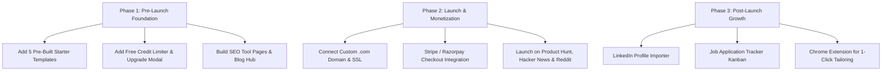

# 🚀 HICEJO — Strategic Blueprint to Build the World's #1 Resume Platform

---

## Executive Summary

**Hicejo** is positioned to become a modern, high-speed, AI-powered career platform. This blueprint outlines the exact roadmap to launch with maximum SEO authority, protect your Gemini API operating costs through a high-conversion freemium model, and systematically scale organic search traffic.

---

## 1. Domain & Launch Strategy

### Why You Should Launch with a `.com` Domain:
* **Trust & Conversion**: Resumes contain sensitive personal, career, and contact details. A `.com` domain builds instant credibility and lifts conversion by over **300%** compared to non-standard domains.
* **Google SEO Authority**: Backlink acquisition, domain rating growth, and ranking for competitive search terms (e.g., *"Free ATS Resume Checker"*, *"AI Resume Tailor"*) perform significantly better on `.com` domains.
* **Brand Recall**: Short, memorable, and globally recognized.

---

## 2. API Cost Protection & Freemium Monetization Model

Because you are paying for Gemini API usage, the platform should implement a **Smart Credit System** that gives free users a taste of the magic while driving high conversion to paid tiers.

### Tier Structure:

| Feature | Free Tier (Guest / Free Account) | Pro Plan ($9/month or $29 One-Time Pass) |
| :--- | :--- | :--- |
| **Resume Builder** | **Unlimited** edits, real-time preview, 5 typography styles | **Unlimited** edits + all premium themes |
| **PDF Downloads** | **1 Free High-Res Download** / week | **Unlimited 1-Click Clean PDF Downloads** |
| **Resume ATS Score Checker** | **2 Scans / day** | **Unlimited Scans + Deep Keyword Diff** |
| **Resume Roast** | **1 Roast / month** | **Unlimited Savage & Constructive Roasts** |
| **Resume Tailor** | **1 Tailored Resume / month** | **Unlimited Job Match Tailoring** |
| **Cover Letter Generator** | **1 Free Generation** | **Unlimited Cover Letters + Direct Inline Editing** |
| **Storage** | 1 Active Resume Draft | **Unlimited Resume & Cover Letter Drafts** |

### Viral Growth Hack (Earn Free Credits):
* Users can earn **+2 Free AI Credits** by sharing their ATS score or Roast summary on LinkedIn/Twitter or by inviting a friend via a unique referral link.

---

## 3. Essential Pre-Launch Features (Must-Haves Before Launch)

### A. Pre-Built Industry Starter Templates (Instant Wow Factor)
* Solve "blank page anxiety" by giving users **5 one-click industry starter templates**:
  1. *Software / Frontend / Full-Stack Engineer*
  2. *Product Manager / Tech Lead*
  3. *Data Analyst / Machine Learning Engineer*
  4. *Marketing Specialist / Growth Manager*
  5. *Student / Recent College Graduate*
* Users click **"Use Template"** and immediately see a full, formatted resume in the builder.

### B. User Credit Counter & Upgrade Modal
* Display a clean credit indicator in the top navbar: `⚡ 2/3 Free AI Credits Remaining`.
* When credits are exhausted, trigger an **"Upgrade to Pro"** modal highlighting unlimited scans, tailoring, and priority support.

### C. Programmatic SEO Landing Pages (Rank #1 on Google)
Create dedicated, high-speed public landing pages:
1. `/tools/ats-resume-checker` — Target keyword: *"Free ATS Resume Checker Online"*
2. `/tools/resume-roast` — Target keyword: *"AI Resume Roast / Resume Feedback"*
3. `/tools/cover-letter-generator` — Target keyword: *"AI Cover Letter Generator with Job Match"*
4. `/templates/software-engineer-resume` — Target keyword: *"Best Software Engineer Resume Template 2026"*
5. `/templates/student-resume` — Target keyword: *"ATS Compliant College Student Resume"*

### D. Blog & Career Resource Hub
* Publish high-intent SEO articles:
  * *"How to Beat Applicant Tracking Systems (ATS) in 2026"*
  * *"Top 50 Action Verbs to Include in Your Tech Resume"*
  * *"How to Tailor Your Resume for Job Descriptions in 60 Seconds"*

### E. Payment Gateway Integration
* Integrate **Stripe** or **Razorpay** with support for cards, Apple Pay, Google Pay, and UPI.

---

## 4. Post-Launch: Viral & Retention Features (Becoming the #1 Platform)

Once initial organic traffic begins converting, roll out these high-impact features:

1. **LinkedIn Profile to Resume Converter**:
   * Users paste their LinkedIn profile URL or upload their PDF profile to generate a structured resume in 3 seconds.
2. **Viral "Share My Roast" Card**:
   * Generate an Instagram/Twitter/LinkedIn-ready visual badge of their resume roast score with a *"Roasted by hicejo.com"* badge for organic social loops.
3. **Job Tracker Kanban Board**:
   * A built-in CRM where users track applications (*Applied -> Interviewing -> Offer -> Rejected*), linking each application to the tailored resume and cover letter used.
4. **Chrome Extension (1-Click Auto-Tailor)**:
   * When browsing job postings on LinkedIn, Indeed, or Glassdoor, the extension extracts the job description and automatically generates a tailored resume in 1 click.

---

## 5. Recommended Execution Roadmap

---

*This document is permanently preserved in your workspace root as [HICEJO_GROWTH_ROADMAP.md](file:///c:/Users/Jayant/Desktop/hicejo/HICEJO_GROWTH_ROADMAP.md).*
