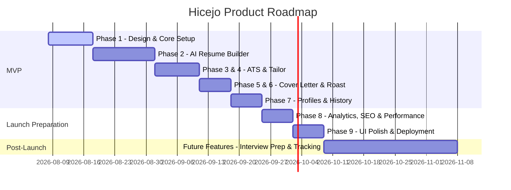

# Project Master Plan: Hicejo (AI Career Platform)

This document serves as the strategic blueprint for **Hicejo**, the operating system for getting hired. Hicejo is designed to transition users from the "I need a job" phase to the "I got hired" phase, supporting them with advanced AI utilities throughout their entire career journey.

---

## 1. Product Vision & Problem Statement

### Product Vision
Hicejo is the ultimate AI Career Platform. We are building the **operating system for getting hired**. Rather than a static resume builder, Hicejo is an intelligent, reactive agentic ecosystem that guides candidates through discovery, optimization, preparation, tracking, and negotiation. Our goal is to level the playing field for job seekers by equipping them with enterprise-grade AI resources to navigate the modern automated recruitment landscape.

### Problem Statement
1. **The Black Box (ATS)**: Over 75% of resumes are filtered out by Applicant Tracking Systems (ATS) before a human ever reads them. Job seekers lack insight into why their applications are rejected.
2. **Generic Tailoring**: Tailoring resumes and cover letters for dozens of jobs is time-consuming. Candidates either apply with generic resumes (resulting in low response rates) or spend hours customizing each manually.
3. **Ineffective Interview Prep**: Mock interviews are expensive, generic, or passive. Candidates lack realistic, role-specific, interactive preparation.
4. **Scattered Workflows**: Job search tools are fragmented. Job seekers use spreadsheet trackers, separate resume editors, standalone cover letter generators, and distinct prep sites, leading to high cognitive overhead.

---

## 2. Target Audience & User Personas

### Target Audience
* **Active Job Seekers**: Professionals actively looking for a new role due to layoffs, career transitions, or career growth.
* **New Graduates**: University students entering a highly competitive entry-level job market.
* **Tech and Knowledge Workers**: Software engineers, product managers, designers, marketers, and analysts looking for high-paying roles.

### User Personas

#### Persona A: Sarah Jenkins (The Mid-Career Transitioner)
* **Age**: 32
* **Current Role**: Marketing Specialist
* **Target Role**: Product Marketing Manager (Tech Sector)
* **Pain Points**: Resumes keep getting rejected by ATS. Struggles to translate traditional marketing metrics into tech product marketing terms. Hasn't interviewed in 5 years.
* **Goal**: Transition to tech, optimize her resume for PMM keywords, track applications in one place, and gain confidence in system-design-like marketing case studies.

#### Persona B: Marcus Chen (The New Graduate)
* **Age**: 22
* **Education**: B.S. in Computer Science
* **Target Role**: Junior Software Engineer
* **Pain Points**: Minimal professional experience besides internships. Competes with thousands of other grads. Does not know how to highlight academic projects effectively.
* **Goal**: Build a strong, clean resume that passes tech screening, practice mock coding/system design reviews, and automate cover letters.

---

## 3. User Journeys

### Journey 1: The Initial Onboarding and Resume Check (Sarah)
1. **Discovery**: Sarah signs up on Hicejo via Google Auth.
2. **Onboarding**: Hicejo asks Sarah about her target industry, role level, and links her LinkedIn.
3. **Upload**: Sarah uploads her current PDF resume.
4. **Roast & Score**: Hicejo performs a "Resume Roast," identifying formatting flaws, grammatical issues, and giving a quick ATS compatibility score.
5. **Interactive Fixes**: Sarah edits her resume in the AI Resume Builder, accepting recommendations for better action verbs and quantified achievements.
6. **Download**: Sarah downloads her optimized, modern PDF resume.

### Journey 2: High-Volume Tailored Applications (Marcus)
1. **Targeting**: Marcus finds a Software Engineer role at Stripe.
2. **Tailoring**: Marcus pastes the job description into Hicejo's Resume Tailor.
3. **AI Review**: The AI identifies gaps in Marcus's CS resume compared to Stripe's requirements (e.g., REST API experience, system scalability).
4. **Optimization**: With one click, Hicejo rewrites bullet points from his CS projects to highlight Stripe's requested skills, generating a tailored PDF and matching Cover Letter.
5. **Tracking**: The application is automatically logged into the Saved Resumes list.

---

## 4. Complete Feature List & Roadmap

### MVP Features (Phase 1 to Phase 7)
1. **Authentication**: Supabase Auth (Email/Password & Social OAuth logins).
2. **Dashboard**: Centralized hub showing application status, score history, quick actions, and premium alerts.
3. **Profile Manager**: Core user data, career goals, target titles, target salaries, and target industries.
4. **AI Resume Builder**: Rich editor with automated bullet points generator, structural validation, and formatting tools.
5. **ATS Resume Checker**: Detailed parser scoring keyword match, readability, formatting, and structural issues.
6. **Resume Tailor**: Paste target job description to match skills, adapt bullet points, and measure alignment.
7. **Cover Letter Generator**: High-converting, tailored cover letters matching the user's resume and job description.
8. **Resume Roast**: Playful yet highly critical, actionable review of the user's resume, highlighting styling and narrative issues.
9. **Saved Resumes & Profile History**: Cloud storage of custom drafts, previous roasts, and generated cover letters.
10. **Resume Download**: High-fidelity PDF generation matching clean design principles (single-page or multi-page formats).

### Future Features (Phase 10+)
1. **Interview Copilot**: Voice-to-text interactive AI interviewer tailored to specific companies (e.g., Google SWE, Stripe PM) with audio feedback.
2. **Automated Job Tracker**: Kanban board visualizing stages (Applied, Interviewing, Offered, Rejected) with automatic reminder emails.
3. **LinkedIn Profile Optimizer**: AI-driven profile checker suggesting headline, about, and experience rewrites to maximize recruiter search hits.
4. **Career Coach AI**: 24/7 chat advisor answering salary negotiation queries, career pivots, and skill paths.
5. **Dynamic Portfolio Builder**: Convert resume details into a hosted, responsive portfolio site.
6. **Recruiter & Team Dashboard**: Multi-user portal allowing recruiters to analyze applicant compatibility scores directly.

---

## 5. Product Roadmap

---

## 6. Business Model, Pricing, & Monetization

### Business Model
Freemium SaaS targeting B2C job seekers, moving to a B2B model (partnerships with bootcamps, universities, and outplacement agencies).

### Pricing Strategy
* **Free Tier ($0/month)**:
  * 1 Resume Draft.
  * 3 AI ATS Checks.
  * 1 Tailored Resume / Cover Letter generation.
  * Standard PDF download.
* **Pro Tier ($19/month or $99/year)**:
  * Unlimited Resumes & Cover Letters.
  * Unlimited ATS checks and deep tailoring.
  * Unlimited Resume Roasts.
  * Premium templates and custom PDF exports.
  * Early access to Interview Copilot.
* **Lifetime/Launch Tier ($149 one-time)**:
  * Offered during Product Hunt launch window for initial cash infusion and early evangelist building.

---

## 7. Marketing, Launch, & SEO Strategy

### SEO Strategy
* **Programmatic SEO**: Automatically generate landing pages targeting long-tail keywords (e.g., `optimize-resume-for-[company]-software-engineer` or `how-to-write-resume-for-[industry]`).
* **Tool-Led Growth**: Embed a free "Instant Resume Grader" widget on high-traffic pages to capture email leads.
* **Blog / Content Strategy**: High-quality editorial guides on career pivots, job-hunting hacks, and salary negotiation tactics.

### Launch Strategy
* **Launch Week Matrix**:
  * **Product Hunt**: Target Tuesday launch. Engage high-influence hunters. Offer a discounted Lifetime deal.
  * **Reddit Launch**: Run value-first threads on r/jobs, r/cscareerquestions, and r/resumes showing how to fix resumes using AI, linking to the tool.
  * **LinkedIn Strategy**: Launch a narrative-driven founder sequence focusing on the "broken ATS" model and recruitment automation. Use interactive polls and custom infographics.

---

## 8. Analytics & Success Metrics

### Analytics Infrastructure
* **Google Analytics 4**: Page views, geographic segmentation, traffic attribution, and blog performance.
* **PostHog**: User behavior analytics, session recordings, heatmaps, and funnel tracking (e.g., Signup -> Resume Upload -> PDF Download).

### Success Metrics
* **North Star Metric**: Resume Export Rate (percentage of signups who successfully customize and download a resume).
* **Key Performance Indicators (KPIs)**:
  * Monthly Recurring Revenue (MRR)
  * LTV:CAC Ratio (Customer Lifetime Value to Acquisition Cost)
  * Day 7 and Day 30 User Retention
  * Average ATS score improvement after tailoring

---

## 9. Future Scaling Plan

1. **Infrastructure**: Migrate to serverless databases and edge functions (Vercel Edge, Supabase connection pooling) to handle flash traffic from launches.
2. **Security**: Achieve SOC 2 compliance to prepare for university and enterprise partnerships.
3. **Custom LLM Fine-Tuning**: Move from generic OpenAI APIs to fine-tuned open-source models (e.g., Llama-3-70B fine-tuned on top-tier resumes) to reduce API costs by up to 60% and improve response speed.
