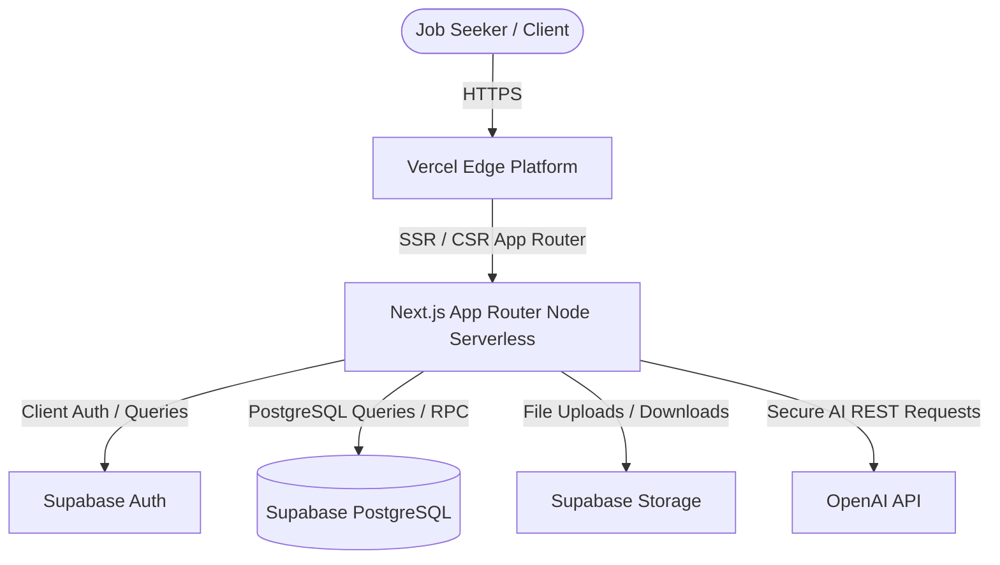

# Technical Specification: Hicejo (AI Career Platform)

This document provides the complete engineering specifications, system architecture, database schema, and coding standards for Hicejo.

---

## 1. System Architecture

Hicejo is built on a modern, serverless, edge-optimized architecture:



---

## 2. Directory Layout

```
hicejo/
├── docs/                      # Project planning and guides (Read-only for coding)
├── src/
│   ├── app/                   # Next.js App Router (pages, API routes, layout)
│   │   ├── (auth)/            # Auth routes group (login, register, reset-password)
│   │   ├── (dashboard)/       # User space (builder, checker, tailor, roast, settings)
│   │   │   ├── dashboard/     # User main landing dashboard
│   │   │   ├── builder/       # Interactive resume builder
│   │   │   ├── checker/       # ATS scanner
│   │   │   ├── tailor/        # Resume tailoring
│   │   │   ├── roast/         # Roast dashboard page
│   │   │   └── history/       # Saved resumes and uploads
│   │   ├── api/               # API Router (internal serverless actions)
│   │   │   ├── ai/            # AI features endpoints (roast, tailor, checker)
│   │   │   └── resume/        # Resume database operations
│   │   ├── layout.tsx         # Root layout (fonts, providers)
│   │   └── page.tsx           # Global landing page
│   ├── components/            # Reusable UI components
│   │   ├── ui/                # shadcn/ui primitives (Button, Card, Input, etc.)
│   │   ├── shared/            # Common layouts (Navbar, Sidebar, Footer)
│   │   └── features/          # Feature-specific composite structures
│   ├── hooks/                 # Custom React hooks (useAuth, useResume, etc.)
│   ├── lib/                   # Utility helpers and clients
│   │   ├── supabase/          # Supabase client declarations
│   │   ├── openai/            # OpenAI helpers
│   │   └── utils.ts           # Styling/utility helpers
│   ├── store/                 # Global UI or state stores (Zustand state slices)
│   └── types/                 # Global TypeScript interfaces and type definitions
├── public/                    # Static assets, fonts, icons
├── tailwind.config.ts         # Design system tokens configuration
├── tsconfig.json              # TypeScript compilation setup
└── package.json               # Package declarations
```

---

## 3. Database Schema (Supabase PostgreSQL)

We use Postgres in Supabase. Database updates are handled via SQL migrations.

### Schema Details

```sql
-- Profiles table linked to Supabase Auth Users
CREATE TABLE public.profiles (
    id UUID PRIMARY KEY REFERENCES auth.users(id) ON DELETE CASCADE,
    email TEXT UNIQUE NOT NULL,
    full_name TEXT,
    avatar_url TEXT,
    target_role TEXT,
    target_industry TEXT,
    target_salary TEXT,
    created_at TIMESTAMP WITH TIME ZONE DEFAULT timezone('utc'::text, now()) NOT NULL,
    updated_at TIMESTAMP WITH TIME ZONE DEFAULT timezone('utc'::text, now()) NOT NULL
);

-- Resumes table tracking drafts
CREATE TABLE public.resumes (
    id UUID DEFAULT gen_random_uuid() PRIMARY KEY,
    user_id UUID NOT NULL REFERENCES public.profiles(id) ON DELETE CASCADE,
    title TEXT DEFAULT 'Untitled Resume' NOT NULL,
    content JSONB DEFAULT '{}'::jsonb NOT NULL, -- Nested resume sections (experience, education, skills, projects)
    ats_score INTEGER DEFAULT 0,
    created_at TIMESTAMP WITH TIME ZONE DEFAULT timezone('utc'::text, now()) NOT NULL,
    updated_at TIMESTAMP WITH TIME ZONE DEFAULT timezone('utc'::text, now()) NOT NULL
);

-- ATS Audits / Roasts history
CREATE TABLE public.ats_scans (
    id UUID DEFAULT gen_random_uuid() PRIMARY KEY,
    user_id UUID NOT NULL REFERENCES public.profiles(id) ON DELETE CASCADE,
    resume_id UUID REFERENCES public.resumes(id) ON DELETE SET NULL,
    score INTEGER NOT NULL,
    feedback JSONB NOT NULL, -- Roasting comments, formatting issues, missing keywords
    job_description TEXT, -- Null if global check, filled if tailored
    created_at TIMESTAMP WITH TIME ZONE DEFAULT timezone('utc'::text, now()) NOT NULL
);

-- Saved Cover Letters
CREATE TABLE public.cover_letters (
    id UUID DEFAULT gen_random_uuid() PRIMARY KEY,
    user_id UUID NOT NULL REFERENCES public.profiles(id) ON DELETE CASCADE,
    resume_id UUID REFERENCES public.resumes(id) ON DELETE SET NULL,
    job_title TEXT NOT NULL,
    company TEXT NOT NULL,
    content TEXT NOT NULL,
    created_at TIMESTAMP WITH TIME ZONE DEFAULT timezone('utc'::text, now()) NOT NULL
);
```

---

## 4. API Design & Endpoints

Next.js Serverless API routes return standard JSON responses and utilize proper HTTP status codes.

| Endpoint | Method | Auth Required | Description |
| :--- | :--- | :--- | :--- |
| `/api/resume` | `GET` | Yes | Retrieve all saved resumes for authenticated user |
| `/api/resume` | `POST` | Yes | Create a new resume draft |
| `/api/resume/[id]` | `PUT`/`DELETE` | Yes | Update or delete a specific resume draft |
| `/api/ai/roast` | `POST` | Yes | Send resume JSON to OpenAI for a roast analysis |
| `/api/ai/check` | `POST` | Yes | Send resume JSON and target job to calculate ATS score |
| `/api/ai/tailor` | `POST` | Yes | Tailor resume bullets based on job description |
| `/api/ai/cover-letter`| `POST` | Yes | Generate tailored cover letter |

---

## 5. Authentication Flow

Authentication is managed using **Supabase Auth** on the client and validated on the server.

* **Client**: Supabase client uses cookies/localStorage to manage sessions. Custom auth state listener in `/src/hooks/useAuth.ts` triggers page redirect rules.
* **Server**: Next.js Middleware checks user sessions via `@supabase/ssr` to protect dashboard routes (`/dashboard/*`). Unauthenticated access triggers a redirect to `/login`.

---

## 6. AI Architecture & LLM Prompts

* **Model Selections**:
  * For fast analysis (Roasts, general grammar checks): `gpt-4o-mini`
  * For deep reasoning (ATS Optimization, Tailoring, Cover Letters): `gpt-4o`
* **Flow**:
  1. Frontend submits resume json/text and job descriptions.
  2. Next.js backend intercepts the call, validates user session, and formats the LLM system prompts.
  3. Next.js calls OpenAI API with strict JSON formatting requests.
  4. OpenAI output is parsed, structured, and saved into the database (`ats_scans`, `cover_letters`), then returned to the client.

---

## 7. Storage Structure

* **Supabase Storage Bucket**: `resumes`
  * Layout: `public.resumes / {userId} / {resumeId}.pdf`
  * Access: Configured via Row Level Security (RLS) policies allowing read/write actions only to the owner of the `userId` folder.

---

## 8. State Management & Error Handling

* **State**: We use **Zustand** for lightweight, localized global state management:
  * `useResumeStore`: Manages the active resume JSON tree, modification history (undo/redo), and save status.
  * `useAuthStore`: Caches active session profiles to prevent unnecessary Supabase auth fetch roundtrips.
* **Error Boundary**: React error boundaries catch client exceptions. Global styling displays a sleek "Something went wrong" card with a refresh action button.
* **API Errors**: Return standard JSON error objects: `{ "success": false, "message": "Error details" }` with correct status codes (400 for Bad Request, 401 for Unauthorized, 500 for Server Error).

---

## 9. Security

* **Row Level Security (RLS)**: Strictly enabled on all Supabase tables. Users can only query tables where `auth.uid() = user_id`.
* **API Route Protection**: NextJS API endpoints check headers using the Supabase Server Client to fetch authorization headers before processing requests.
* **Input Sanitization**: API inputs are validated using `zod` schemas before database insertion or LLM calls.

---

## 10. Performance Optimization

* **Edge/Server Rendering**: Dynamic dashboard routes are server-side rendered (SSR) with caching optimized through React Suspense for asynchronous loading.
* **Image Delivery**: Auto-optimized icons and landing illustrations loaded via `next/image` with webp encoding.
* **Code Splitting**: Dynamic loading (`next/dynamic`) for hefty libraries (e.g., PDF viewer, Framer Motion) to reduce initial bundle weights.

---

## 11. Environment Variables

Create `.env.local` in root:
```env
NEXT_PUBLIC_SUPABASE_URL=https://your-project.supabase.co
NEXT_PUBLIC_SUPABASE_ANON_KEY=eyJhbGciOiJIUzI1NiIsInR5cCI6IkpXVCJ9...
SUPABASE_SERVICE_ROLE_KEY=your-supabase-service-role-key-for-migrations
OPENAI_API_KEY=sk-proj-...
NEXT_PUBLIC_SITE_URL=http://localhost:3000
```

---

## 12. Coding Standards & Naming Conventions

* **Language**: TypeScript (strict type check enabled).
* **Naming**:
  * Component files: PascalCase (e.g., `ResumeEditor.tsx`)
  * Helpers and Hooks: camelCase (e.g., `useResume.ts`, `formatDate.ts`)
  * Folders: lowercase/kebab-case (e.g., `components/ui/`, `app/api/`)
* **Styling**: Tailwind utility classes sorted logically (e.g., structural layout -> positioning -> colors -> transitions).
